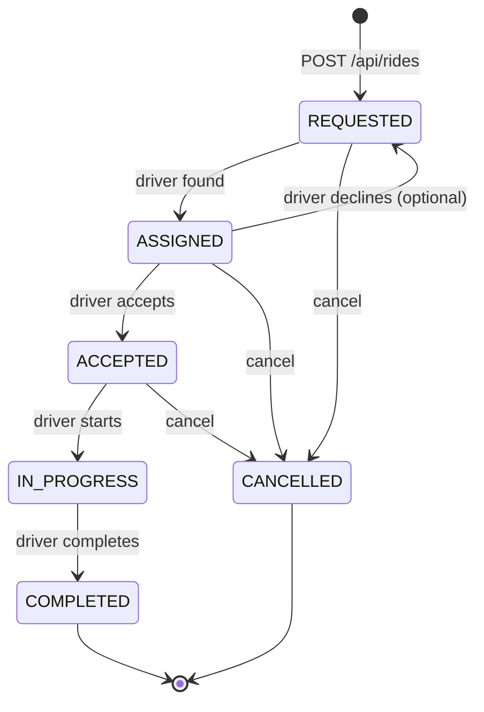
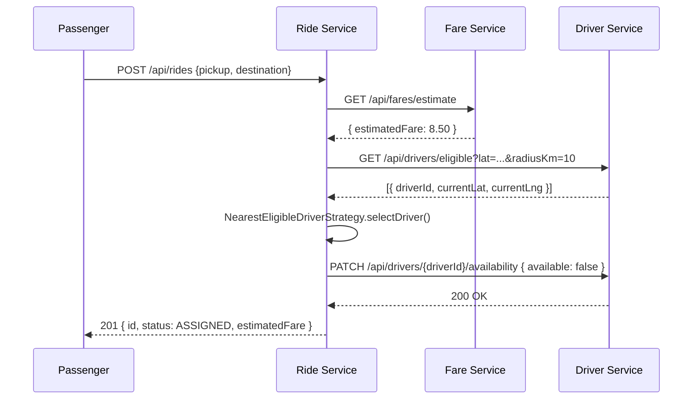
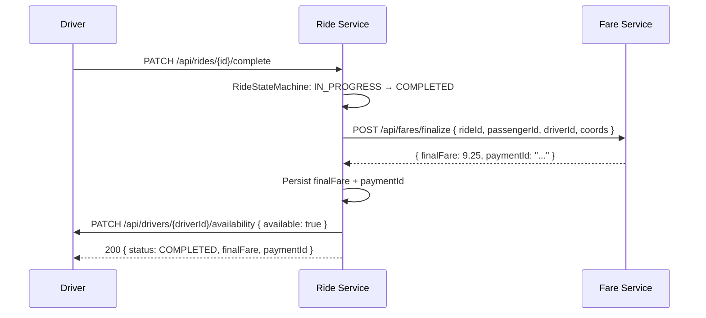

# RideLink – Ride Management Service

> **Service #3 of 4** | Port `8083` | Package root: `com.ridelink.ride`

---

## Overview

The Ride Management Service owns the full lifecycle of a ride:

```
REQUESTED → ASSIGNED → ACCEPTED → IN_PROGRESS → COMPLETED
                  ↘ CANCELLED ↙ (from any non-terminal state)
```

It coordinates with the **Driver & Vehicle Service** (port 8082) for driver assignment and the **Fare & Payment Service** (port 8084) for fare estimation and payment.

---

## Prerequisites

| Tool        | Version      |
|-------------|-------------|
| Java        | 17          |
| Maven       | 3.9+        |
| MongoDB Atlas | MongoDB SRV connection string |

Ride data is stored in the `ride_management` database in MongoDB Atlas. The stub profile fakes the sibling services only; it still needs a reachable MongoDB database.

---

## Environment Variables

Copy `.env.example` to `.env` and fill in values. The service loads this local file when it is started from the service directory; do not commit the populated `.env`.

| Variable              | Description                                  | Required |
|-----------------------|----------------------------------------------|----------|
| `MONGODB_URI`         | MongoDB Atlas SRV URI for this service       | ✅ |
| `JWT_SECRET`          | Base64-encoded HS256 key shared with Account Service | ✅ |
| `DRIVER_SERVICE_URL`  | Base URL of the Driver & Vehicle Service     | ✅ (prod) |
| `FARE_SERVICE_URL`    | Base URL of the Fare & Payment Service       | ✅ (prod) |
| `SPRING_PROFILES_ACTIVE` | Set to `stub` for local demo without sibling services | optional |

**Generate a secret:**
```bash
openssl rand -base64 32
```

---

## Run Commands

### Standalone demo with stubbed sibling services
```bash
cd ride-management-service
export JWT_SECRET=$(openssl rand -base64 32)
export MONGODB_URI='mongodb+srv://it24102021_db_user:<url-encoded-password>@cluster0.ue11zov.mongodb.net/ride_management?retryWrites=true&w=majority&appName=Cluster0'
export SPRING_PROFILES_ACTIVE=stub
mvn spring-boot:run
```

Replace `<url-encoded-password>` with the Atlas database user's password. URL-encode reserved characters in the password. Ensure the machine's IP is allowed in the Atlas Network Access list.

On Windows PowerShell, set the variables before starting the service:
```powershell
$env:MONGODB_URI = 'mongodb+srv://it24102021_db_user:<url-encoded-password>@cluster0.ue11zov.mongodb.net/ride_management?retryWrites=true&w=majority&appName=Cluster0'
$env:JWT_SECRET = '<shared-base64-secret>'
$env:SPRING_PROFILES_ACTIVE = 'stub'
mvn spring-boot:run
```

### With real sibling services
```bash
export JWT_SECRET=<shared-secret>
export MONGODB_URI='mongodb+srv://it24102021_db_user:<url-encoded-password>@cluster0.ue11zov.mongodb.net/ride_management?retryWrites=true&w=majority&appName=Cluster0'
export DRIVER_SERVICE_URL=http://localhost:8082
export FARE_SERVICE_URL=http://localhost:8084
mvn spring-boot:run
```

### Run tests
```bash
mvn test
```

### Build + verify (CI equivalent)
```bash
mvn -B verify
```

---

## API Endpoints

| Method | Path                         | Role(s)                     | Description                  |
|--------|------------------------------|-----------------------------|------------------------------|
| POST   | `/api/rides`                 | PASSENGER                   | Create ride + assign driver  |
| GET    | `/api/rides/{id}`            | PASSENGER owner / DRIVER / ADMIN | Get ride by ID          |
| GET    | `/api/rides/me`              | PASSENGER                   | Own rides (optional ?status) |
| GET    | `/api/rides/driver/me`       | DRIVER                      | Rides assigned to me         |
| GET    | `/api/rides`                 | ADMIN                       | All rides (paged + ?status)  |
| PATCH  | `/api/rides/{id}/accept`     | assigned DRIVER             | Accept ride                  |
| PATCH  | `/api/rides/{id}/start`      | assigned DRIVER             | Start ride                   |
| PATCH  | `/api/rides/{id}/complete`   | assigned DRIVER             | Complete ride + payment      |
| PATCH  | `/api/rides/{id}/cancel`     | PASSENGER / DRIVER / ADMIN  | Cancel (with reason)         |

**Swagger UI:** [http://localhost:8083/swagger-ui.html](http://localhost:8083/swagger-ui.html)  

---

## Sample Test Data (stub mode)

The stub profile provides:

- **Stub driver:** `driverId = 00000000-0000-0000-0000-000000000001`, name: "Stub Driver Alice"
- **Estimated fare:** £8.50, **Final fare:** £9.25
- **Payment ID:** `00000000-0000-0000-0000-aabbccddeeff`

**Sample create-ride request:**
```json
{
  "pickupAddress":      "University Gate, London",
  "pickupLat":          51.5074,
  "pickupLng":          -0.1278,
  "destinationAddress": "King's Cross Station",
  "destinationLat":     51.5309,
  "destinationLng":     -0.1233
}
```

**Sample JWT payload (for testing):**
```json
{
  "sub":  "aaaa0000-0000-0000-0000-000000000001",
  "role": "PASSENGER",
  "iat":  1700000000,
  "exp":  9999999999
}
```

---

## Driver Assignment Rule

**Strategy:** `NearestEligibleDriverStrategy` (implements `DriverSelectionStrategy`)

1. Call the Driver Service to get all `AVAILABLE` drivers within **10 km** of the pickup.
2. Compute the **Haversine great-circle distance** from each driver's current location to the pickup coordinates.
3. Select the driver with the **smallest distance**.
4. **Tie-break:** if two drivers are equidistant, the one with the lexicographically smaller `driverId` UUID string is chosen (deterministic).
5. If no drivers found → HTTP **409** with `NoDriverAvailableException`.

*Alternative strategies can be plugged in by providing a different `DriverSelectionStrategy` bean.*

---

## State Diagram



---

## Sequence Diagrams

### (a) Create Ride + Assignment



### (b) Complete Ride + Payment



---

## Project Structure

```
ride-management-service/
├── src/main/java/com/ridelink/ride/
│   ├── RideManagementApplication.java
│   ├── config/          # SecurityConfig, MongoConfig, OpenApiConfig
│   ├── controller/      # RideController
│   ├── domain/          # Ride, RideStatus, RideStateMachine, RideStatusHistory
│   ├── dto/             # CreateRideRequest, CancelRideRequest, RideResponse, RideMapper
│   ├── exception/       # GlobalExceptionHandler + all custom exceptions
│   ├── client/          # DriverServiceClient, FareServiceClient interfaces + HTTP impls
│   │   └── stub/        # Stub implementations for demo/test
│   ├── repository/      # MongoDB RideRepository
│   ├── security/        # JwtTokenValidator, JwtAuthenticationFilter, RideLinkPrincipal
│   └── strategy/        # DriverSelectionStrategy, NearestEligibleDriverStrategy
├── src/test/java/...
│   ├── domain/          # RideStateMachineTest
│   ├── service/         # RideServiceTest
│   ├── repository/      # RideMongoMappingTest
│   └── controller/      # RideControllerTest
├── docs/
│   ├── contracts/       # ride-service-dependencies.md
│   └── postman/         # Postman collection
├── .env.example
├── .gitignore
└── pom.xml
```

---

## Design Decisions (for viva)

| Decision | Rationale |
|----------|-----------|
| MongoDB Atlas per service | Ride records stay in this service's own database; the URI is supplied through environment configuration |
| State machine as utility class | Single place for transition logic (SRP) – easier to test and reason about |
| Strategy pattern for driver selection | Open/Closed: swap algorithm without touching service code |
| Interface for clients | Dependency Inversion – stub profile swaps implementations transparently |
| MapStruct for mapping | Compile-time generated code, no reflection overhead, easy to audit |
| JWT raw token as Spring Security credentials | Allows controllers to forward the token to downstream services |
| Embedded ride status history | Audit trail is stored atomically with each ride document |
| Best-effort driver availability release | Not rolling back the ride completion if the Driver Service is temporarily down |

---

## Assumptions & Open Questions

See [`docs/contracts/ride-service-dependencies.md`](docs/contracts/ride-service-dependencies.md) for the full list.

**Key assumptions:**
1. JWT `sub` claim = Account Service `userId` for both passengers and drivers.
2. JWT `role` claim is a single string: `"PASSENGER"`, `"DRIVER"`, or `"ADMIN"`.
3. Driver Service returns current simulated coordinates in the eligible-drivers response.
4. Fare Service accepts coordinates (not pre-computed distance/duration).

**Gaps vs spec:**
- No retry logic on downstream calls (would add with Spring Retry or Resilience4j).
- No event bus / async messaging (out of scope for synchronous REST assignment).
- `ASSIGNED → REQUESTED` (driver decline) transition is modelled but no dedicated endpoint is exposed yet.
